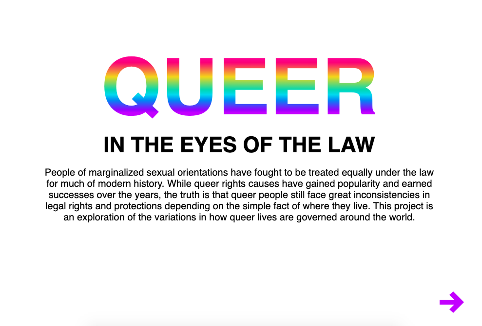
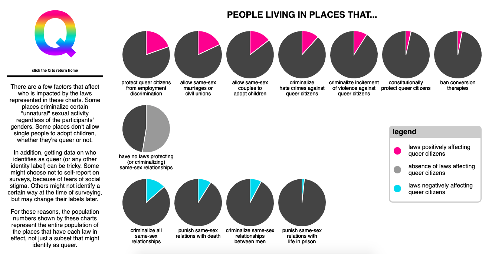
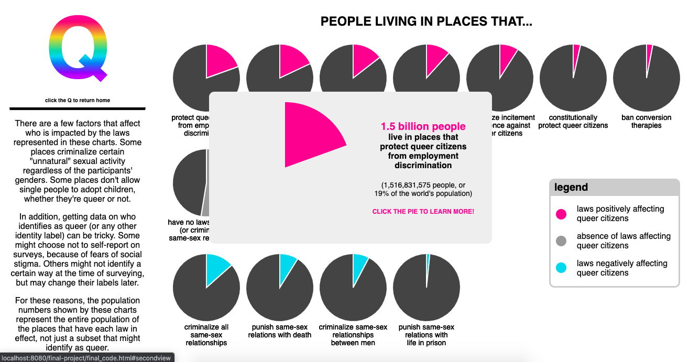
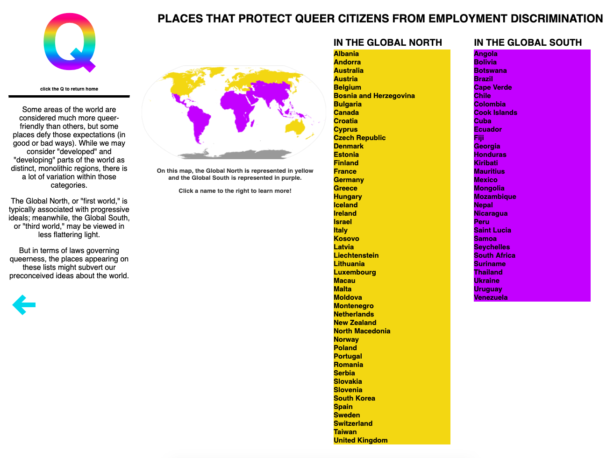
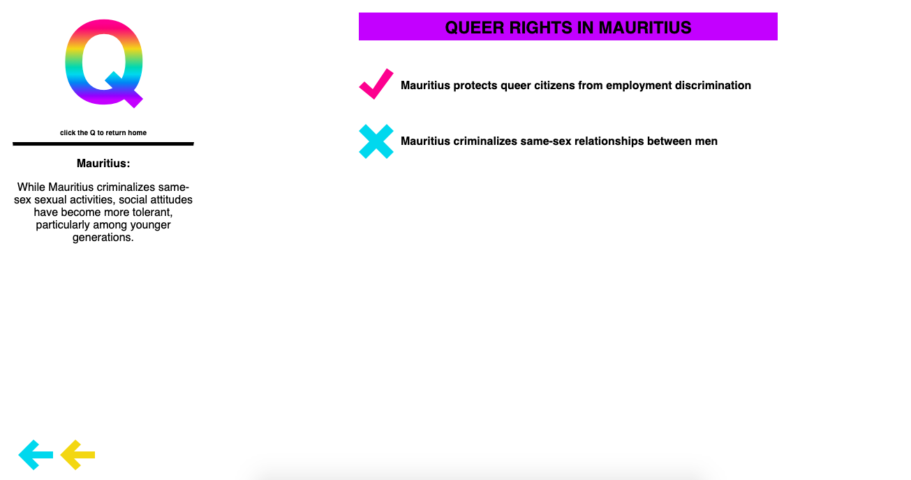

# Final Project

This project is based on data from [ILGA World](https://ilga.org/state-sponsored-homophobia-report-2019-global-legislation-overview), which regularly compiles a dataset of laws affecting people of marginalized sexual orientations, alongside a report entitled "State-Sponsored Homophobia." This data was integrated with population data from [Worldometers](https://www.worldometers.info/world-population/population-by-country/), as well as research on individual countries\* from [Wikipedia](https://en.wikipedia.org/). The final dataset, after being cleaned in Google Sheets, is available [here](final_data.csv).

The first view of this project is an introduction to the topic of the visualization (see below, Fig. 1). Clicking the arrow at the bottom right leads to the second view. The second view is a series of pie charts, representing the populations living in places that have certain laws versus the population of the rest of the world (see below, Fig. 2). On a hover, a tooltip appears highlighting the relevant section of the pie chart, along with exact population data (see below, Fig. 3). Clicking on a pie leads to the third view, a list of countries\* that have the law in question, divided into categories of Global North and Global South (see below, Fig. 4). The third view also includes a map that shows which countries fall into the categories of Global North and Global South. Clicking the arrow in the bottom left leads back to the second view. Clicking on a country's\* name leads to the fourth view, showing details of the country's\* sexual orientation-related laws (see below, Fig. 5). The fourth view also includes a one- or two-sentence detail about queer rights in the country\* in question. Clicking the turquoise arrow in the bottom left leads back to the second view; clicking the yellow arrow next to it leads back to the third view. On all views following the first one, the rainbow "Q" leads back to the first view.

This project uses a combination of D3, Javascript, HTML, and CSS. The basic page is hosted [here](./final_code.html); the style is hosted [here](final_style.css); and the script is hosted [here](final_script.js). All views are shown on the same webpage, using a CSS smooth scrolling property to lead the user between views on a click. Data visualizations are rendered upon clicking on the arrow or the other leading item in question. On clicking the "Q", the second, third, and fourth views are erased; on clicking the turquoise back arrow, the third and fourth views are erased; on clicking the yellow back arrow, the fourth view is erased.

\* In this readme, the word "countries" is used as a general term; six of the 199 regions included in this data are not UN-recognized countries, but are distinct regions not contained within a UN-recognized country.

### Figure 1: Initial view — introduction to project

### Figure 2: Second view — pie charts

### Figure 3: Second view — pie charts on hover

### Figure 4: Third view — list of countries

### Figure 5: Fourth view — details of individual countries

